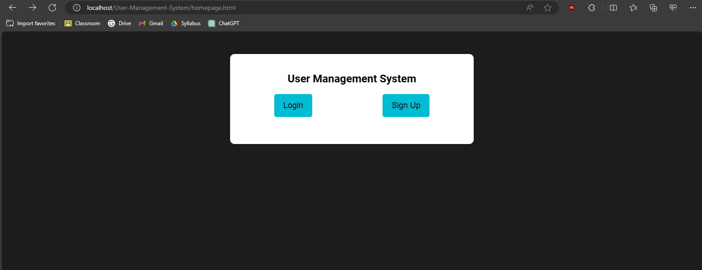
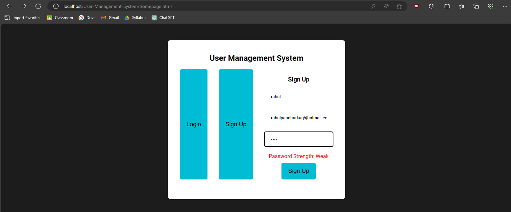
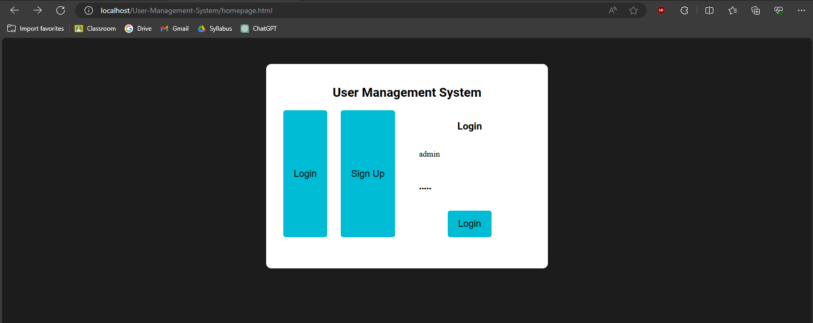
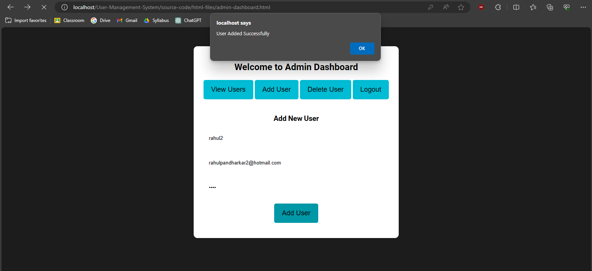
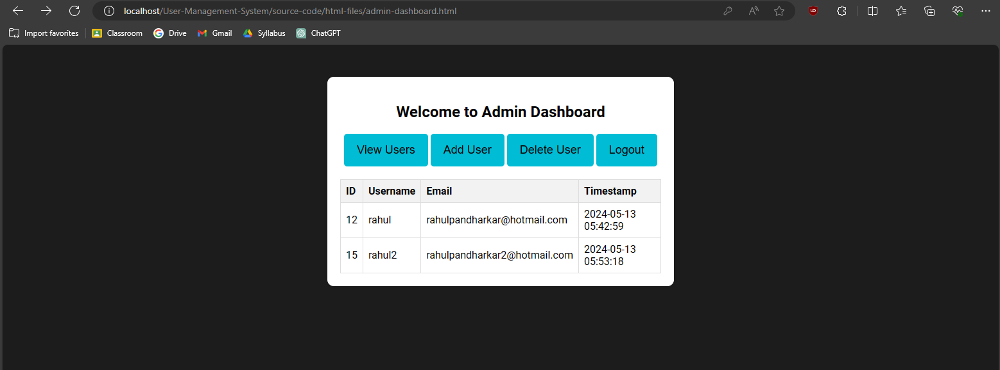
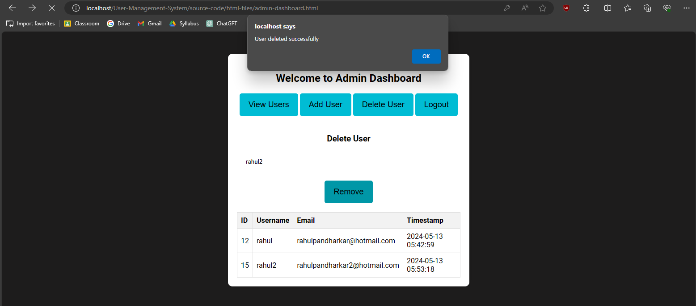

# User Management System

## Description
The User Management System is a web application designed for administrators to manage users on a platform. It provides functionalities for admins to view, add, and delete users, as well as login and sign up functionalities for users.

## Features
- **Login**: Users can log in to the system using their username and password.
- **Sign Up**: New users can create an account by providing a username, email, and password.
- **View Users**: Administrators can view a list of all users registered on the platform.
- **Add User**: Administrators can add a new user to the system by providing a username, email, and password.
- **Delete User**: Administrators can delete a user from the system by specifying their username.
- **Password Strength Checker**: Provides real-time feedback on the strength of the password during sign up.

## Technologies Used
- **Frontend**: HTML, CSS, JavaScript, jQuery
- **Backend**: PHP
- **Database**: MySQL
- **AJAX**: Asynchronous JavaScript and XML for making asynchronous HTTP requests
- **Bootstrap**: Frontend framework for responsive design
- **jQuery**: JavaScript library for simplifying DOM manipulation and AJAX requests

## Prerequisites
1. MySQL: <https://dev.mysql.com/downloads/>
2. Xampp: <https://www.apachefriends.org/download.html>

Note: If starting SQL Service of Xampp gives any error with respect to port number of MySQL in use, close the service manually from Task Manager or Service Manager and reclick on "Start".

## Installation
1. Clone the repository:
   ```bash
   git clone https://github.com/rahulpandharkar/user-management-system.git
2. Rename the Repository Folder to "User-Management-System" (case-sensitive)
3. Paste the "User-Management-System" Folder to the "htdocs" folder of the Xampp Directory
4. Open Xampp, start Apache and MySQL processes
5. Now visit <https://localhost/User-Management-System/homepage.html> to get started with.

## Screenshots













